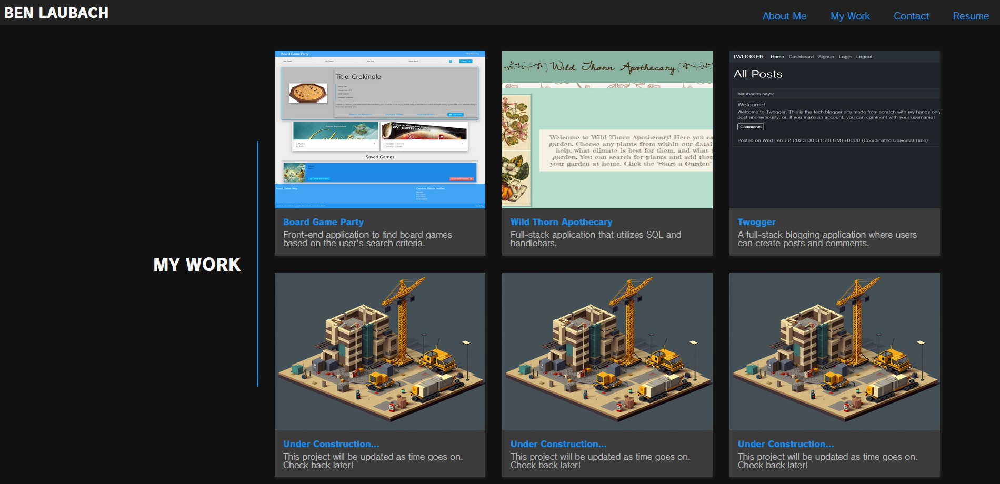

# My Portfolio

## Description

This project was built with react to create a single page portfolio to update as time goes on to improve for employers to see in the future. I will be actively working on this and improving it/updating projects as soon as possible.

## Table of Contents

- [Installation](#installation)
- [Usage](#usage)
- [License](#license)
- [Questions](#questions)
- [Features](#features)

## Installation

None required. Feel free to visit the site [here](https://blaubachs.github.io/portfolio/).

## Usage

Feel free to click around and take a look at each page. You are able to download my resume from the resume page.

## License

Not licensed.

## Questions

Github: [blaubachs](https://github.com/blaubachs)

Contact: Feel free to schedule a meeting with me with the calendly link on my portfolio, or, reach out to me on LinkedIn.

---

